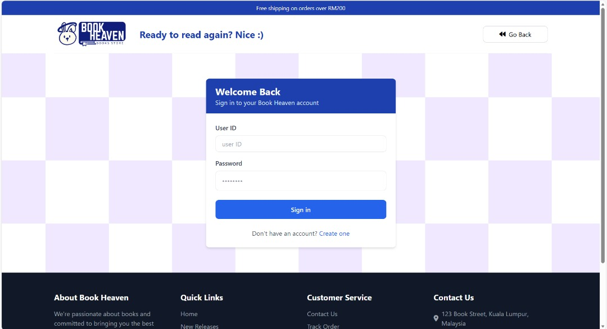
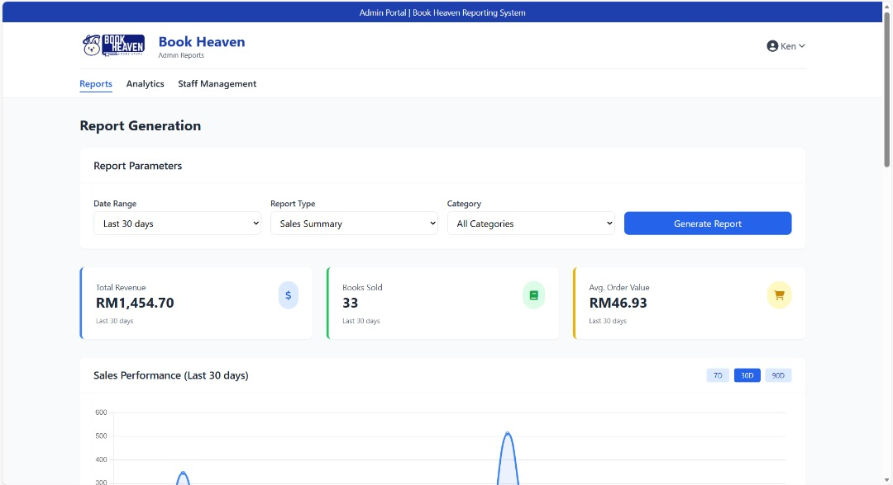
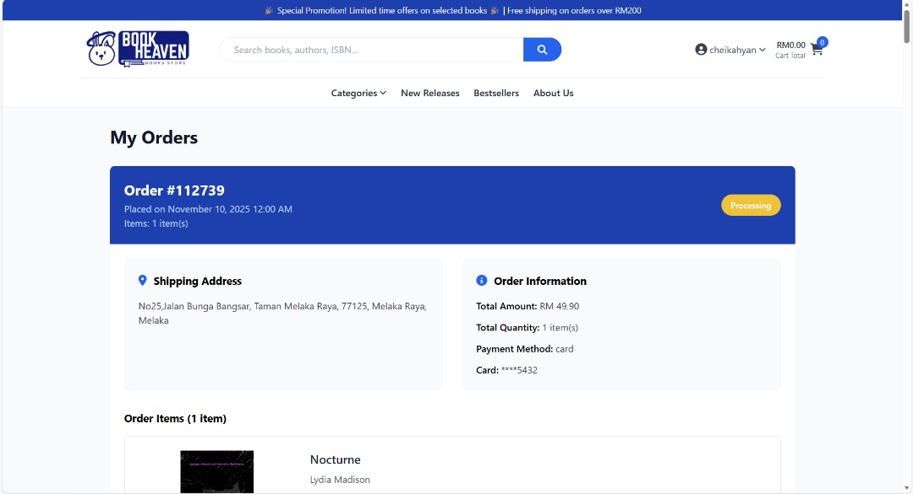
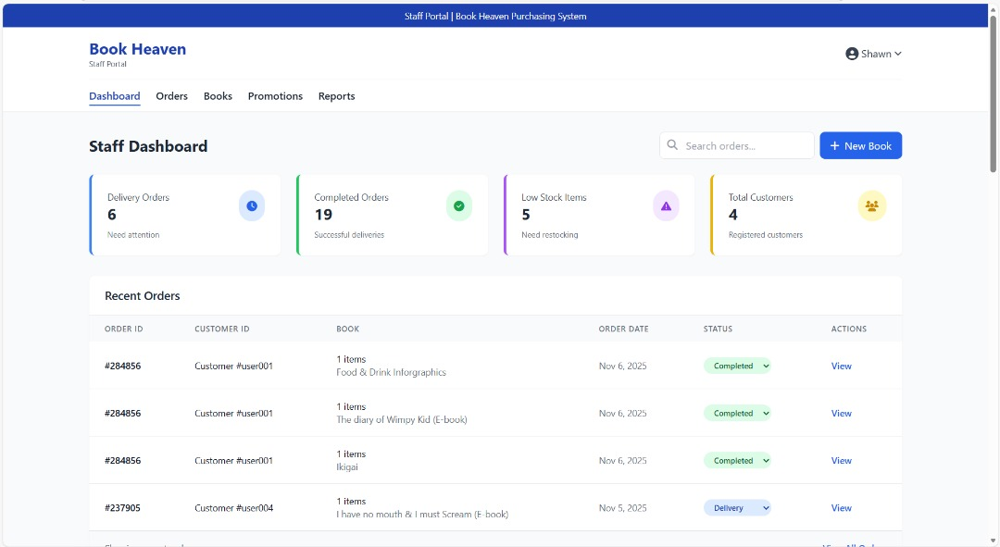

 

  

# BHPS - Book Heaven Purchasing System

BHPS is an online book purchasing system with customer, staff, and admin roles. Admins manage the platform, oversee the entire catalog, and handle user accounts, while staff manage orders and content, and customers purchase books through a seamless process.

  
Table of Contents

  <ol>
    <li>
      <a href="#screenshots">Screenshots<a/>
      <ul>
        <li><a href="#web-screenshots">Web Screenshots</a></li>
      </ul>
    </li>
    <li>
      <a href="#features">Features</a>
    </li>
    <li><a href="#technologies-used">Technologies Used</a></li>
    <li>
      <a href="#getting-started">Getting Started</a>
      <ul>
        <li><a href="#prerequisites">Prerequisites</a></li>
        <li><a href="#installation">Installation</a></li>
      </ul>
    </li>
    <li><a href="#contribution">Contribution</a></li>
    <li><a href="#license">License</a></li>
  </ol>

## Screenshots:

### Web Screenshots

<table>
  <tr>
    <td align="center"><strong>Sign In</strong></td>
    <td align="center"><strong>Main Page</strong></td>
  </tr>
  <tr>
    <td></td>
    <td></td>
  </tr>
  <tr>
    <td align="center"><strong>Book Detail Page</strong></td>
    <td align="center"><strong>Checkout Page</strong></td>
  </tr>
  <tr>
    <td></td>
    <td></td>
  </tr>
  <tr>
    <td align="center"><strong>Order Page</strong></td>
    <td align="center"><strong>Staff Page</strong></td>
  </tr>
  <tr>
    <td></td>
    <td></td>
  </tr>
  <tr>
    <td align="center"><strong>Admin Page</strong></td>
  </tr>
  <tr>
    <td></td>
  </tr>
</table>

## Features:
- Registration: Quick sign-up and login for new and returning customers.
-	Book Management:  Staff add, update, and delete books.
-	Order & Payment Management: Customers make orders and pay securely, after making payment, customers can view and cancel order; staff process orders and update statuses; The system supports multiple payment methods and generates email receipts.
-	Reporting: Admins generate sales report and staff can view and download sales reports to track performance.
-	Registration: Quick sign-up and login for new and returning customers.
-	Book Management:  Staff add, update, and delete books.
-	Order & Payment Management: Customers make orders and pay securely, after making payment, customers can view and cancel order; staff process orders and update statuses; The system supports multiple payment methods and generates email receipts.
-	Reporting: Admins generate sales report and staff can view and download sales reports to track performance.

## Technologies Used:
Software Components:
•	Web Server: XAMPP (Apache) [Installation Guide](https://docs.flutter.dev/get-started/install)
•	Database: MySQL (via phpMyAdmin)
•	Frontend: HTML, CSS, JavaScript, Bootstrap
•	Backend: PHP
•	Framework: Next.js
•	Version Control: GitHub / GitHub Desktop
•	Browser Compatibility: Google Chrome, Microsoft Edge, and other modern browsers

## Getting Started:
To get started with BookHeaven on your local machine, follow the steps below:

### Prerequisites:
- **Install XAMPP (Apache)**: For phpMyAdmin access.
- **Install VS Code** (Optional): For development.
  - If using VS Code, install the **PHP Intelephense** and **PHP Server** from the VS Code Marketplace.

## Contribution:
Thank you for the team that have contributed to the development of this website!

## License:
This project uses multiple open-source licenses depending on the technologies used:
- Apache License 2.0 (Apache-2.0) — applied to the main backend logic and server-side scripts.
- Mozilla Public License 2.0 (MPL-2.0) — used for parts of the project involving shared or modified open-source components.
- Open Software License 3.0 (OSL-3.0) — covers the general project distribution and collaborative work.
- HTML, CSS, JavaScript, and MySQL — developed and used under their respective open and free usage terms.
This project follows open-source principles and is distributed for educational and non-commercial use.

## Acknowledgments:
- VSCode: For offering great tools for PHP development.
- XAMPP (Apache): For offering tools in phpMyAdmin database development.
